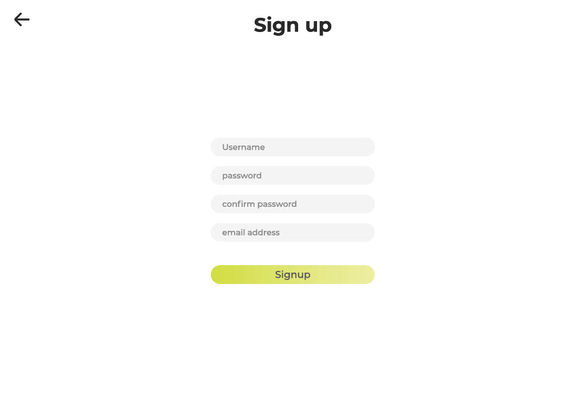

# Project Description:

For tourists who are willing to travel accross North America, they can see landscape posts based on the pin on the map they choose. Heat map will highlight the most popular city and tourists can like the posts they viewed.

---

## TO-do List

### Minimal:

-   [x] View posts on a page
-   [x] ordered posts by created date on default
-   [x] Add, delete posts
-   [x] Each contain photos, text content, geolocation, and user name
-   [x] Authentication for users

### Standard:

-   [x] Map with markers to access posts for certain location
-   [x] Use a heapmap to indicate Hot Travel Location
-   [x] Like a post and show like counts
-   [x] allow auto-complete when entering the location
-   [x] users can see the post photos with slide show
-   [x] Can sort post list either by date or by like count
-   [x] Edit user profile
-   [x] allow users to change password
-   [x] page animations for improving user experience

### Stretch:

-   [x] Can search the city by keywords
-   [x] Share to social media and email
-   [x] encrypte user's password for security reason
-   [x] fairly considerate on user behaviors and adjust front-end accordingly
-   [x] use drag and drop method to upload photos
-   [ ] Comments on a post
-   [ ] nearby, message others
-   [ ] In user’s profile, user is allowed to get a stamp for traveling to a city/place. (virtual passport collection)

## Technologies Used:

### - Unit 1: HTML, CSS, JS

Go Travel used CSS both directly and indirectly to style various components throughout the application, which includes buttons, input box, icons, and transitions based on user behavior with unified style. While we want to create a unique style for the website and be able to adjust to meet our expectation, we didn't choose any public CSS such as Material UI or others. Using CSS inside styled-components makes our React components more readable and uniform. CSS was easier to use for styling than HTML, along with adding design and flexibility to make the UI appear much more stylish and conveniently placed for users.

### - Unit 2: React

Go Travel used React to build the client-facing side of the app. We used components to reduce code duplication and reuse components throughout the app. It was fairly convenient to use hooks in order to achieve complex functionality and response on the page, and also the Redux to easily store and access authentication and application-wide data.

### - Unit 3: Node & Express

Go Travel used Node.js and Express to build out the backend for our application. Node and Express allowed us to operate CRUD behaviors on post data and user info via sending requests. After creating models for our MongoDB database, we are able to send requests with formatted information to the database using Express. Since Express is a minimal framework that builds off of Node, it is easy to use and allowed us to quickly use robust routing, error handling, and middleware on the server side.

### - Unit 4: NoSQL with MongoDB

Go Travel uses a MongoDB backend with custom schemas to store users, posts, and cities information. The flexible nature of NoSQL allowed us to plan a way that we wanted to store information, and make requests to the stored information in the MongoDB Atlas cloud database. With document-based query language and JSON-style information storage, working with and querying the data in our database was quicker and easier than would have been possible using traditional SQL storage considering our documents do not all have a standard layout.

### - Unit 5: Release Engineering

Go Travel uses git and GitHub for version control, with collaborators using different branches to write enhancements and fix bugs. We only push changes to the "main" branch after collaborators manually test enhancements to ensure there are no new bugs introduced. We set up an admin email with a new Heroku account, configuring the "main" branch to automatically deploy changes to the production build through Heroku because Heroku is a simple to use platform that team members were familiar with, and it contains GitHub integration.

## Issues we encountered

1. Since post data were included in city data, it was hard and slow to operate on single post. Therefore, we decide to take a week to split these two types of data and use id to connect them in between and among other modification on the front-end due to this change.

2. While building the project, we were struggling with an async issue between rendering the page with old data and fetching the new data, since fetching would take longer when we have images. In the end, we managed to use a status state and a loading component insert in between to fix the issue.

3.

## Above and Beyond Functionality:

- Posts Map
 - uses the google-map API, change the color scheme of the map to adapt the style of the website, populates the map with color-coded activity pins, ranks the city with highlighted heatmap, and provides auto-complete for entering locations. 
- Photo drag and drop
 - uses react-images-uploading API to achieve the feature of photos uploading on Add Posts page. 
- Photos slideshow
 - uses swiper API allowing slide show of photos. 
- Page Animations 
 - uses framer-motion API to improve user experience through page animations. 
- Share to Social Media  
 - uses react-share API to link to social media and auto-generate sharing content in social media. 
- User side   
 - With Go travel's focus on User Experience and usability, minute details such as the zoom functionality of the map, to the user feedback during any user changes, as well as overall style and responsiveness were not overlooked.

## Next Steps:

-   Make the heatmap more dynamic and interactive, and come up with a better algo to determine the layers.
-   Add a profile picture function for the user and give a user stamp collection function for their posts based on cities to encourage users to post more and travel more.

## List of Contributions:

### [Shawn Gu](https://www.linkedin.com/in/shawn-gu-0b96a2a0/)

-   Web design and UIUX
-   Took responsible for developing a responsive front-end for Main, User, Post list, Post, and Login / Signup pages.
-   Designed and set up the data structure and data flow with Redux and also in React.
-   Coordinated and scheduled meetings, planned work distribution.
-   Deployed the app and performed refactor.

### [Xinye Zhan](https://www.linkedin.com/in/terry-zhan-211088187/)

-   Took responsible for developing a responsive front-end for Add-Posts,  Post detail, and Search pages.
-   In the Add-posts page, implement the get user current location function and auto-complete function to help user type in location information more efficiently and implement the photo upload function that allows the user to upload photos by drag and drop
-   Implement a photos slideshow function on the post-detail page that allows users to see a list of photos.
-   Implement  photos and text animation in the post detail page; And implement page animations for Main, Add Posts, Post Detail, User, Login pages
-   Integrating Redux for delete posts, add-post frontend, and post-detail frontend 
-   Design liking-post function frontend in Post Detail page

### [Kaining Zheng](https://www.linkedin.com/in/kaining-zheng-7499831a9/)

-   Refactor cities Model in server, saparate Posts from cities.
-   Implement get, add, and delete Post in server side.
-   Create Post reducer in redux. And linked it with server side.
-   Create databse and connect it with server.
-   Add like count in Post detail.
### [Jin Niu](https://www.linkedin.com/in/jin-niu-3a5174244/)

-   Implemented the user system for users to manage their information and posts. Inculding server&Redux work of Signup/Login/Editinformation/ChangePassword/likePost
-   Connect the user system to other parts with authorizion check to enhance security. 
-   Create user databse and connect it with server.
-   Refactor Cities, seperate it from posts in order to make operations make more sense.
-   Backend work of search feature. Handle the geolocation of post and part of dataflow.

## Prototypes 🎨

See pdf gotraveldesign

